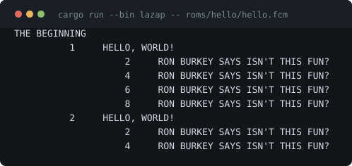
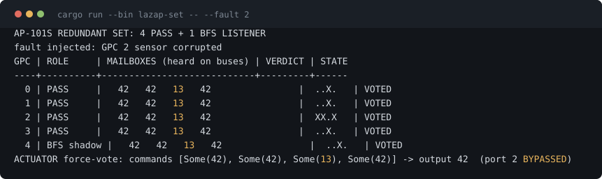
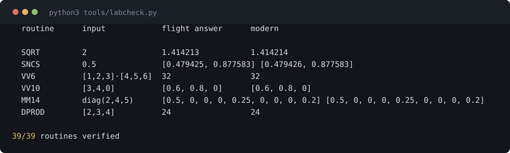
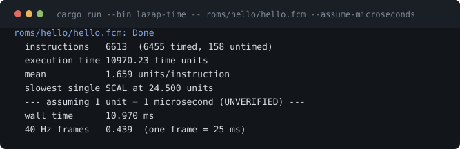

# Lazarus AP

**The Space Shuttle's computing world, brought back to life.**

An emulator of the IBM AP-101S — the flight computer that flew every
Shuttle mission — built page by cited page from IBM's own *Principles of
Operation*, together with the recovered flight toolchain that fed it.
Real Shuttle software runs here: thirty routines of the genuine flight
runtime library, HAL/S programs compiled by the actual Space Shuttle
compiler, and five emulated computers voting against each other the way
the orbiter's did.

▶ **[The interactive resource](docs/index.html)** — narrated execution,
source stepped against the machine code it compiled to, the five-computer
vote, the crew keyboard and CRT, the flight math, the history, and a
defect report. One self-contained page; serves from GitHub Pages
(Settings → Pages → `main` / `docs`).



That is a HAL/S program compiled by the genuine Space Shuttle compiler,
executing on an emulated AP-101S. Every image in this repository runs.

*(Every terminal card below is generated by `tools/mkshots.py` from the
real output of the real binary — CI fails if one drifts. None of them is
a mockup.)*

---

## What runs

| | |
|---|---|
| **The machine** | AP-101S CPU (138 instructions), hexadecimal floating point, interrupts, storage protection, the IOP with its Master Sequence Controller and 24 Bus Control Elements, and per-instruction execution times from the flight compiler's own table |
| **The redundant set** | Five GPCs on shared serial buses: listen mode, sync discretes, timeout voting, force-voted actuators, fault injection, a BFS-style shadow listener |
| **The crew station** | DEU keyboard and CRT over the display buses — type at it in your terminal |
| **Flight software** | Four HAL/S programs at byte-for-byte parity with the reference emulator; WRITE, READ, floats, and ON ERROR recovery |
| **The toolchain** | The genuine HAL/S-FC compiler (release 32V0, all seven passes) and ASM101S assembler, both rebuilt and running; our own linker replaces the one piece history didn't preserve |
| **NASA flight code** | 202 of 205 recovered runtime routines assemble; **40 runnable images, all 40 verified** — 39 against modern mathematics every CI run, plus the attitude pipeline in an integration test |
| **Provenance** | Every traced address is attributed to the routine that owns it, from the linker's own table; where the evidence to attribute it did not survive, the page says so instead of guessing |



Five computers on shared serial buses. One has been given a corrupted
sensor and reports **13** where the others report 42; the healthy
majority outvotes it and the force-voting actuator ignores its command.
The mechanism is emulated from documentation — NASA's own redundancy-
management software has never been released.



The Shuttle's own mathematics, re-run and re-checked against modern
values on every build. Note the fourth column: `SQRT(2)` comes back as
1.4142132 where a modern machine says 1.4142136. That gap is the
hexadecimal floating point this machine actually used.



And what it cost. The guidance loop ran at 40 Hz — a new answer every 25
milliseconds, no option to run late. Printing eight short lines burns
close to half a frame, because almost all of it is character formatting.
Inverting a 3×3 matrix costs under 2%. That ratio is why flight software
does not print things. *(The time unit itself is unconfirmed — see
[src/timing.rs](src/timing.rs).)*

## Run it

```bash
cargo run --bin lazap-dps                 # crew station: type at the DPS keyboard
cargo run --bin lazap-set                 # five computers vote out a faulty one
cargo run --bin lazap-set -- --kill 1     # kill one, watch the survivors outvote its silence

cargo run --bin lazap -- roms/hello/hello.fcm       # a real HAL/S program
cargo run --bin lazap -- roms/lazarus/LAZARUS.fcm   # written here, compiled by the Shuttle's compiler
echo "42, 3.14" | cargo run --bin lazap -- roms/read_write/read_write.fcm

tools/resurrect.py SQRT:2.0 EXP:1.0 EPROD:2,3,4     # bring NASA routines back, checked
cargo run --bin lazap-trace -- roms/lazarus/LAZARUS.fcm   # the trace behind the web page
cargo run --bin lazap -- examples/sum.asm           # assemble and trace your own program
cargo test                                          # 189 tests
python3 tools/check_symtabs.py                      # symbol tables match their object decks
python3 tools/labcheck.py                           # all 39 routines vs modern mathematics
cargo run --bin lazap-time -- roms/hello/hello.fcm --assume-microseconds
```

Requires a stable Rust toolchain. The historical toolchain (ASM101S,
HAL/S-FC) is Python and lives in the Virtual AGC tree — see
[docs/ROADMAP.md](docs/ROADMAP.md) for the fetch-and-build recipe.

## The flight math, running again

Thirty-nine genuine routines, each assembled by the real flight
assembler and re-checked against modern mathematics on every CI run —
full table in [roms/nasa/lab.md](roms/nasa/lab.md), generated by
`tools/labcheck.py` from the manifest in `roms/nasa/lab.json`. The
fortieth, the attitude pipeline, needs sensor data polled over the IOP
and so is verified by an integration test instead:

```
SQRT(2)             = 1.4142135        EXP(1) = 2.7182817
dot [1,2,3]·[4,5,6] = 32               cross  x × y = [0,0,1]
UNIT [3,4,0]        = [0.6, 0.8, 0]    det diag(2,3,4) = 24
3x3 multiply, 3x3 inverse, sinh/cosh/tanh, asinh/acosh/atanh,
atan2, fmod, powers, sums, products, maxima, minima - single and double precision
```

Dot products for angles, cross products for perpendiculars,
normalization for headings, matrix multiply to compose rotations,
inverse to undo them: the operations the orbiter used to know which way
it was pointing.

## Honesty

The AP-101's instruction set is not fully documented in public sources,
so this project treats reconstruction as a research deliverable:

- Every implemented instruction cites its page in IBM 85-C67-001.
- Anything unverified is marked **UNVERIFIED** and left unimplemented
  rather than guessed — see [docs/ISA_STATUS.md](docs/ISA_STATUS.md).
- Deliberate deviations (documented hardware anomalies we chose not to
  replicate, emulator conventions where the record is silent) are listed
  with reasons.
- Bugs found — in the hardware's own documentation, in the recovered
  tools, and in this emulator — are filed in
  [roms/nasa/DEFECTS.md](roms/nasa/DEFECTS.md).
- Claims about what ran where are made only where a surviving artifact
  supports them. 176-P's object deck is lost, so the walkthrough
  declines to say which routines were its own.
- The historical toolchain is no longer on the build machine; what can
  and cannot be regenerated is tabulated in
  [docs/ROADMAP.md](docs/ROADMAP.md).

If you find a behavior this emulator gets wrong against period
documentation or hardware evidence, that's a bug — please report it with
the source.

## Documentation

| File | What's in it |
|---|---|
| [docs/ISA_STATUS.md](docs/ISA_STATUS.md) | Every instruction: encoding, status, citation |
| [docs/IOP_STATUS.md](docs/IOP_STATUS.md) | MSC and BCE instruction sets, bus model |
| [docs/DEU_STATUS.md](docs/DEU_STATUS.md) | Crew interface: what's sourced, what's convention |
| [docs/ARCHITECTURE.md](docs/ARCHITECTURE.md) | Design and language rationale |
| [docs/SOURCES.md](docs/SOURCES.md) | Primary sources and what each confirmed |
| [docs/PRIOR_ART.md](docs/PRIOR_ART.md) | How this relates to Virtual AGC and nsts-sim-gpc |
| [docs/ROADMAP.md](docs/ROADMAP.md) | Phases, including the toolchain build recipe |
| [roms/nasa/CENSUS.md](roms/nasa/CENSUS.md) | The resurrection scoreboard |
| [roms/nasa/DEFECTS.md](roms/nasa/DEFECTS.md) | Defect report, filed as you would today |

## Standing on shoulders

The recovered artifacts this project depends on — the AP-101S manuals,
the HAL/S compiler source, the assembler, the fixture programs — exist
because of **Ron Burkey's Virtual AGC project** and **Don Schmidt's**
AP-101S emulation work. Lazarus AP cites their work throughout and
cross-checks against it; the goal is not to duplicate it but to carry it
further: a complete, verified, runnable resurrection of the machine, its
languages, its toolchain, and its flight mathematics.

## License

**GPL v2-or-later** (see [LICENSE](LICENSE)).

Parts of this project derive from Virtual AGC, which is GPL
v2-or-later — `src/timing.rs` is a port of yaGPC2's timing tables — so
the whole is licensed to match rather than sit in conflict with it.

The recovered NASA/IBM flight sources vendored under `roms/nasa/` are
public domain and are not covered by that licence. [NOTICE](NOTICE)
sets out exactly what came from where.
